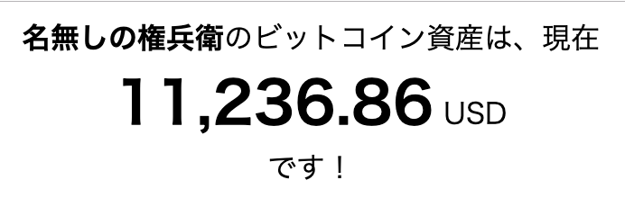

# My Crypto

特定の仮想通貨資産を表示するだけの、なんということはないトイアプリ。



## How to use

```bash
$ cp .env{.sample,}
$ vi .env
$ heroku create
$ heroku plugins:install heroku-config
$ heroku config:push
$ git push heroku master
```
